# JARKOM MODUL 2 2026 - K01

## Member

| Nama | NRP |
| --- | --- |
| Umar | 5027251005 |
| Syarifah Nailatur Rohma | 5027251109 |

## Laporan

### Topologi

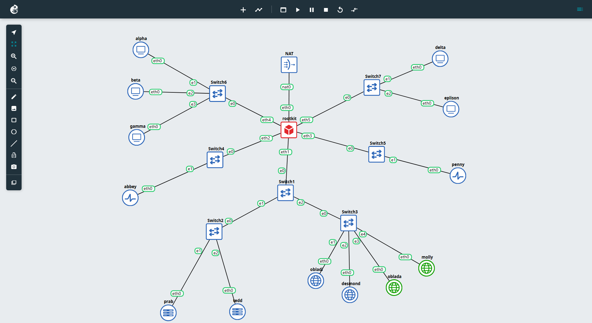

`rootkit` berfungsi sebagai router pusat yang menghubungkan lima segmen jaringan internal. Prefix IP kelompok yang digunakan adalah `10.64.x.x` dengan subnet mask `/24`.

| Segmen | Interface rootkit | Gateway | Entitas |
| --- | --- | --- | --- |
| 10.64.1.0/24 | eth1 | 10.64.1.1 | prab, tedd, obladi, desmond, oblada, molly |
| 10.64.2.0/24 | eth2 | 10.64.2.1 | abbey |
| 10.64.3.0/24 | eth4 | 10.64.3.1 | alpha, beta, gamma |
| 10.64.4.0/24 | eth3 | 10.64.4.1 | penny |
| 10.64.5.0/24 | eth5 | 10.64.5.1 | delta, epilson |

### 1. Konfigurasi IP dan gateway

`rootkit` menggunakan `eth0` sebagai interface WAN melalui DHCP. Interface `eth1` sampai `eth5` digunakan sebagai gateway untuk lima jaringan internal.

Konfigurasi yang terdapat pada `nodes/rootkit/init.sh`:

```bash
auto eth0
iface eth0 inet dhcp

auto eth1
iface eth1 inet static
    address 10.64.1.1
    netmask 255.255.255.0

auto eth2
iface eth2 inet static
    address 10.64.2.1
    netmask 255.255.255.0

auto eth3
iface eth3 inet static
    address 10.64.4.1
    netmask 255.255.255.0

auto eth4
iface eth4 inet static
    address 10.64.3.1
    netmask 255.255.255.0

auto eth5
iface eth5 inet static
    address 10.64.5.1
    netmask 255.255.255.0
```

Daftar alamat setiap entitas:

| Entitas | IP address | Gateway | Peran |
| --- | --- | --- | --- |
| rootkit | eth1 `10.64.1.1`, eth2 `10.64.2.1`, eth3 `10.64.4.1`, eth4 `10.64.3.1`, eth5 `10.64.5.1` | - | Router |
| alpha | `10.64.3.2/24` | `10.64.3.1` | Client |
| beta | `10.64.3.3/24` | `10.64.3.1` | Client |
| gamma | `10.64.3.4/24` | `10.64.3.1` | Client |
| prab | `10.64.1.2/24` | `10.64.1.1` | DNS master |
| tedd | `10.64.1.3/24` | `10.64.1.1` | DNS slave |
| abbey | `10.64.2.2/24` | `10.64.2.1` | Proxy core |
| penny | `10.64.4.2/24` | `10.64.4.1` | Proxy vault |
| delta | `10.64.5.2/24` | `10.64.5.1` | Client |
| epilson | `10.64.5.3/24` | `10.64.5.1` | Client |
| obladi | `10.64.1.4/24` | `10.64.1.1` | Web statis |
| desmond | `10.64.1.5/24` | `10.64.1.1` | Web statis |
| oblada | `10.64.1.6/24` | `10.64.1.1` | Web dinamis |
| molly | `10.64.1.7/24` | `10.64.1.1` | Web dinamis |

Konfigurasi client pada `nodes/alpha/init.sh`:

```bash
auto eth0
iface eth0 inet static
    address 10.64.3.2
    netmask 255.255.255.0
    gateway 10.64.3.1
```

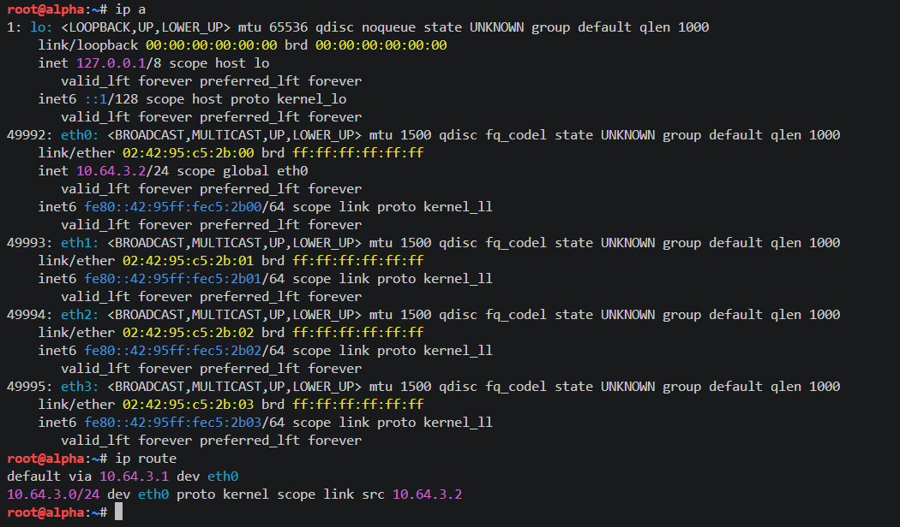

Hasil pengujian menunjukkan bahwa `alpha` memperoleh alamat `10.64.3.2/24`,
menggunakan gateway `10.64.3.1`, dan memiliki route default menuju `rootkit`.

### 2. NAT dan akses internet

Pada `rootkit`, IPv4 forwarding diaktifkan agar paket dapat diteruskan antarinterface. NAT masquerade diterapkan pada interface WAN `eth0`, kemudian trafik dari seluruh interface internal diizinkan menuju WAN.

Konfigurasi dari `nodes/rootkit/init.sh`:

```bash
apt update
which iptables &>/dev/null || apt install iptables -y

sysctl -w net.ipv4.ip_forward=1
iptables -t nat -A POSTROUTING -o eth0 -j MASQUERADE

iptables -A FORWARD -i eth1 -o eth0 -j ACCEPT
iptables -A FORWARD -i eth2 -o eth0 -j ACCEPT
iptables -A FORWARD -i eth3 -o eth0 -j ACCEPT
iptables -A FORWARD -i eth4 -o eth0 -j ACCEPT
iptables -A FORWARD -i eth5 -o eth0 -j ACCEPT
```

Pengujian dilakukan dengan memeriksa `ip route`, tabel NAT, lalu menjalankan `ping -c 3 192.168.122.1` dari client.

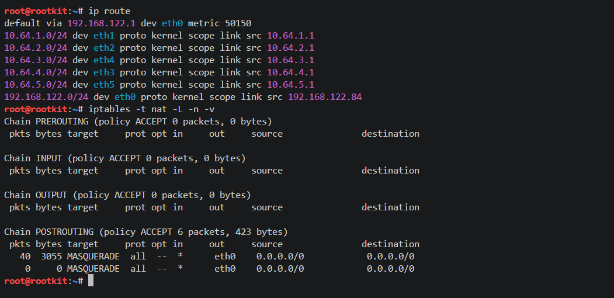
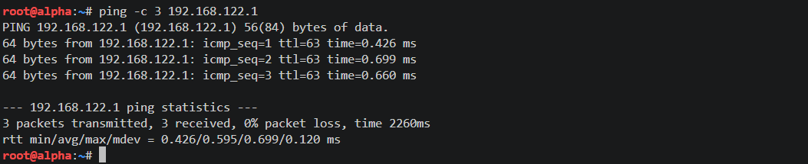

Tabel NAT menunjukkan rule `MASQUERADE` pada `eth0`, sedangkan hasil ping
membuktikan bahwa trafik dari jaringan internal dapat diteruskan ke WAN.

### 3. Routing internal dan resolver awal

Setiap node non-router memiliki default gateway menuju `rootkit`. Resolver awal digunakan agar node dapat mengakses jaringan luar dan mengunduh paket. Konfigurasi resolver final untuk node setelah DNS internal aktif adalah:

```text
nameserver 10.64.1.2
nameserver 10.64.1.3
nameserver 192.168.122.1
```

Isi resolver pada node yang menggunakan DNS internal:

```bash
cat <<EOF > /etc/resolv.conf
nameserver 10.64.1.2
nameserver 10.64.1.3
nameserver 192.168.122.1
EOF
```

Pada tahap awal `prab` dan `tedd`, resolver `192.168.122.1` digunakan terlebih dahulu untuk instalasi. Setelah DNS internal aktif, resolver diganti ke urutan `prab`, `tedd`, lalu resolver eksternal.

Pengujian routing dilakukan dengan ping antarclient dan ping dari client menuju node pada subnet lain.

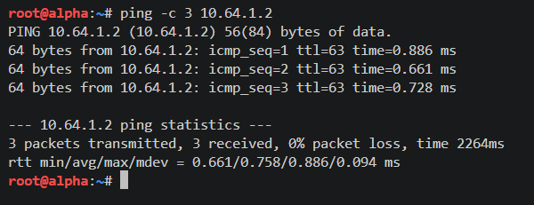

Ping antarsegmen membuktikan bahwa `rootkit` meneruskan paket antarjaringan.
Urutan resolver mencoba DNS internal terlebih dahulu, lalu resolver eksternal
sebagai fallback.

### 4. DNS authoritative master-slave

Setelah konfigurasi jaringan selesai, layanan DNS dikonfigurasi pada terminal `prab` dan `tedd`. `prab` berperan sebagai master zona `k01.com`, sedangkan `tedd` menjadi slave dengan master `10.64.1.2`.

Konfigurasi jaringan awal `prab` pada script:

```bash
auto eth0
iface eth0 inet static
    address 10.64.1.2
    netmask 255.255.255.0
    gateway 10.64.1.1

echo "nameserver 192.168.122.1" > /etc/resolv.conf
```

Konfigurasi master BIND9 yang diterapkan pada `prab`:

```conf
options {
    directory "/var/cache/bind";
    forwarders { 192.168.122.1; };
    allow-query { any; };
    auth-nxdomain no;
    listen-on { any; };
    listen-on-v6 { any; };
};

zone "k01.com" {
    type master;
    file "/etc/bind/k01/k01.com";
    allow-transfer { 10.64.1.3; };
    notify yes;
};
```

Konfigurasi slave pada `tedd`:

```conf
zone "k01.com" {
    type slave;
    masters { 10.64.1.2; };
    file "/var/cache/bind/k01.com";
};
```

Verifikasi dilakukan dengan query SOA dari kedua nameserver.

- client query SOA (master 10.64.1.2)
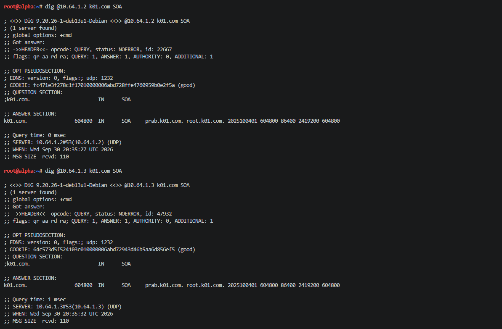

Jawaban SOA menunjukkan `prab` sebagai master authoritative dan `tedd` sebagai
slave yang menerima zona yang sama.

### 5. Identitas host dan hostname

Hostname setiap entitas disesuaikan dengan glosarium praktikum: `rootkit`, `alpha`, `beta`, `gamma`, `delta`, `epilson`, `prab`, `tedd`, `abbey`, `penny`, `obladi`, `desmond`, `oblada`, dan `molly`. Nama domain setiap entitas dicatat pada zona `k01.com`.

Record A yang digunakan:

```dns
alpha   IN A 10.64.3.2
beta    IN A 10.64.3.3
gamma   IN A 10.64.3.4
delta   IN A 10.64.5.2
epilson IN A 10.64.5.3
abbey   IN A 10.64.2.2
penny   IN A 10.64.4.2
```

Pengujian dilakukan dengan `hostname`, `ip addr`, dan `dig alpha.k01.com A` dari client.

- client query hostname dan IP
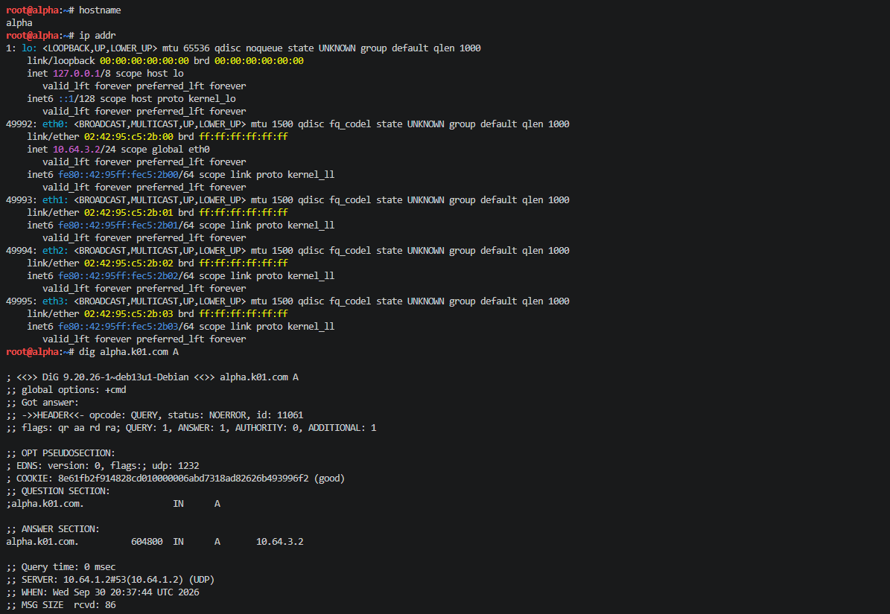

Hasil pengujian mencocokkan hostname node, alamat IP, dan record A pada zona
`k01.com`. Query `alpha.k01.com` mengembalikan alamat `10.64.3.2`.

### 6. Zone transfer

Forward zone dan reverse zone dideklarasikan sebagai master pada `prab`, lalu ditarik oleh `tedd` sebagai slave. Nilai serial SOA pada kedua nameserver harus sama setelah transfer selesai.

```bash
dig @10.64.1.2 k01.com SOA

dig @10.64.1.3 k01.com SOA
```

Zone transfer dinyatakan berhasil apabila serial SOA sama dan `tedd` memberikan
jawaban authoritative.

- client query SOA (master 10.64.1.2)
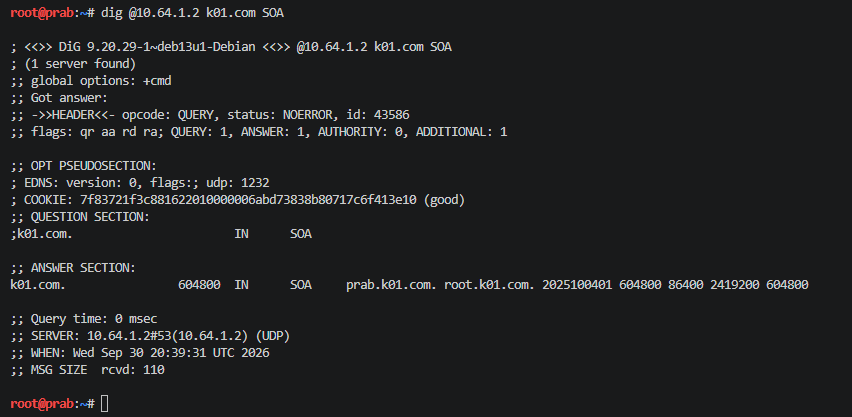
- client query SOA (slave 10.64.1.3)
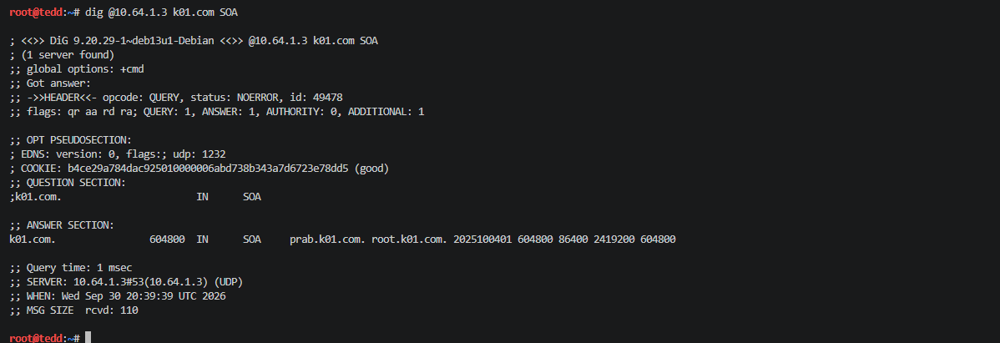

Serial SOA pada master dan slave sama, dan jawaban dari `tedd` bersifat
authoritative. Hal ini membuktikan zone transfer telah berhasil.

### 7. Record vault, core, dan CNAME

Record layanan pada zona `k01.com` adalah sebagai berikut:

```dns
vault  IN A     10.64.1.4
vault  IN A     10.64.1.5
core   IN A     10.64.1.6
core   IN A     10.64.1.7
www    IN CNAME penny.k01.com.
static IN CNAME abbey.k01.com.
```

`vault` menunjuk ke `obladi` dan `desmond`, sedangkan `core` menunjuk ke `oblada` dan `molly`. Pengujian dilakukan dari dua client dengan `dig` untuk memastikan jawaban konsisten.

- client query vault, core, www, dan static (master 10.64.1.2)
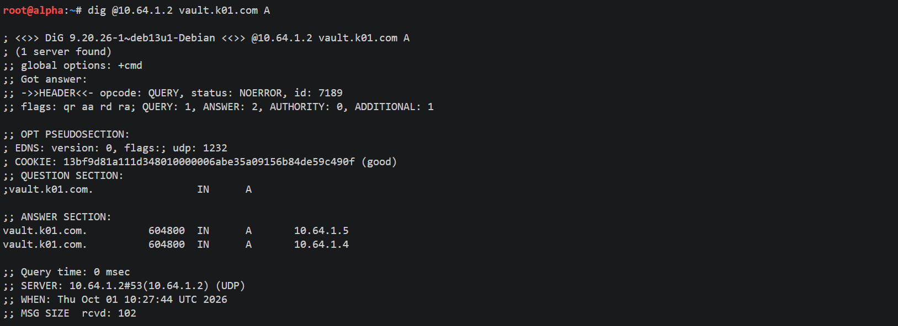
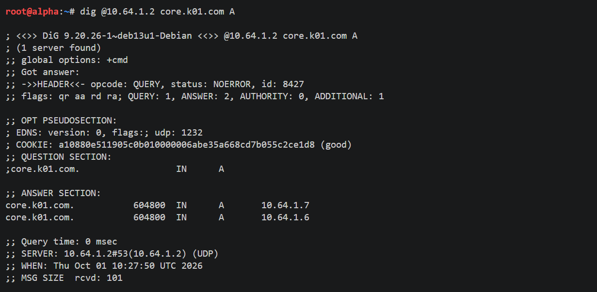
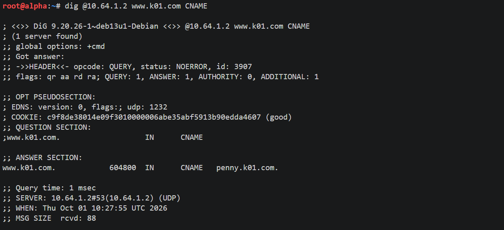
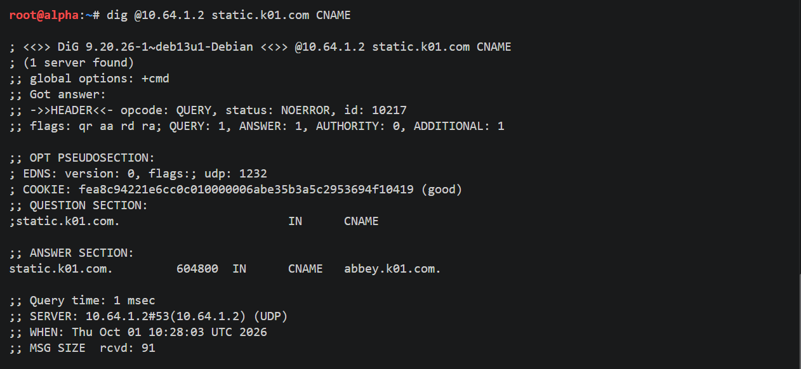

- client query vault, core, www, dan static (slave 10.64.1.3)
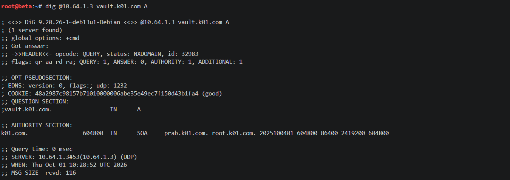
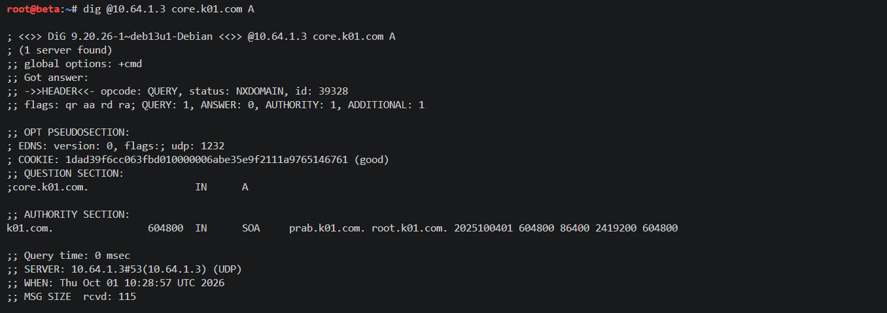
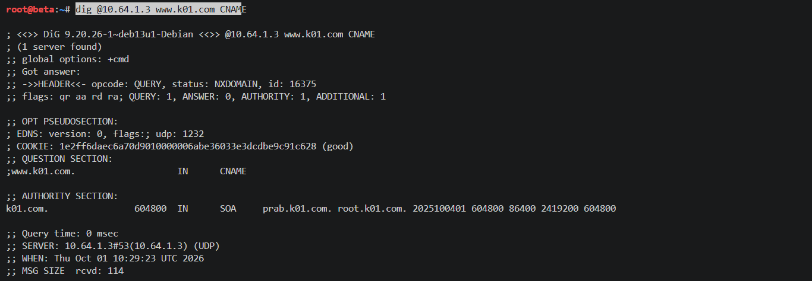
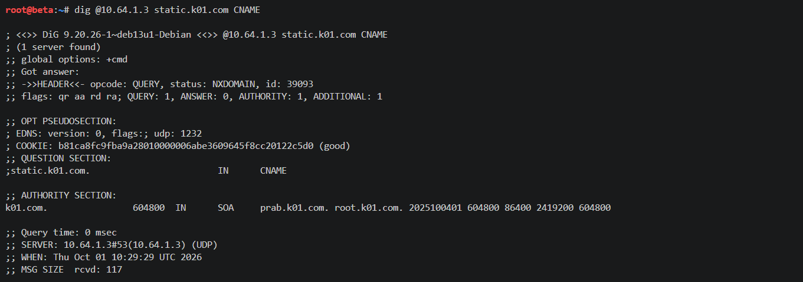

Query pada master dan slave menghasilkan record yang konsisten. `vault` dan
`core` mengarah ke dua backend masing-masing, sedangkan `www` dan `static`
menggunakan CNAME menuju `penny` dan `abbey`.

### 8. Reverse DNS

Reverse zone digunakan untuk menerjemahkan alamat IP kembali menjadi hostname. Record PTR yang digunakan antara lain:

```dns
2 IN PTR prab.k01.com.
3 IN PTR tedd.k01.com.
4 IN PTR obladi.k01.com.
5 IN PTR desmond.k01.com.
6 IN PTR oblada.k01.com.
7 IN PTR molly.k01.com.
```

Pada reverse zone proxy, `10.64.2.2` diarahkan ke `abbey.k01.com` dan `10.64.4.2` diarahkan ke `penny.k01.com`.

```bash
dig @10.64.1.2 -x 10.64.2.2
dig @10.64.1.2 -x 10.64.1.4
dig @10.64.1.3 -x 10.64.2.2
dig @10.64.1.3 -x 10.64.4.2
```

- client query DNS master (10.64.1.2)
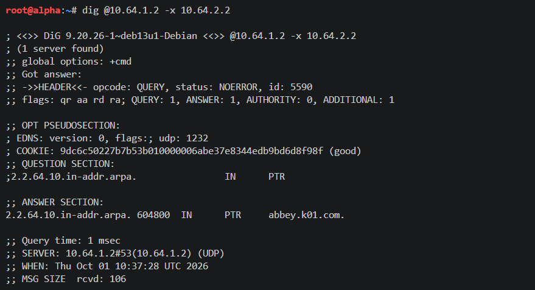
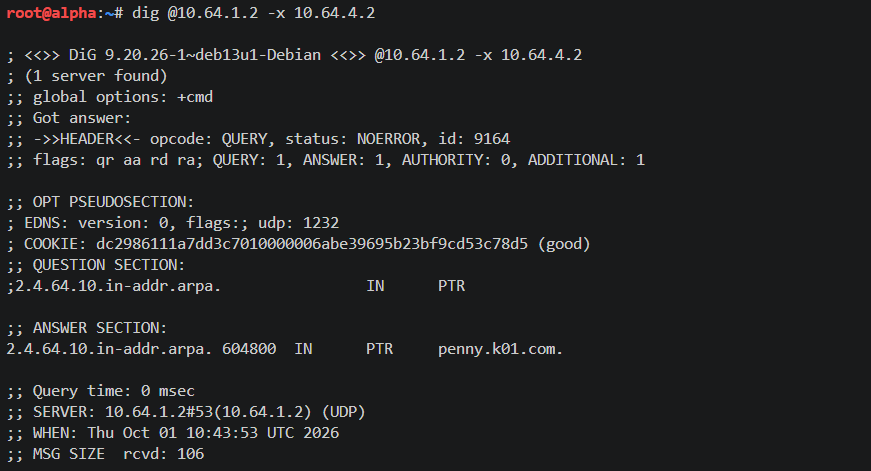

- client query DNS slave (10.64.1.3)
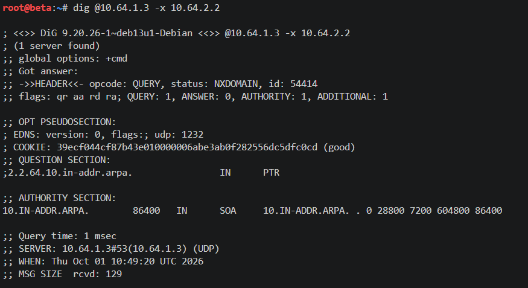
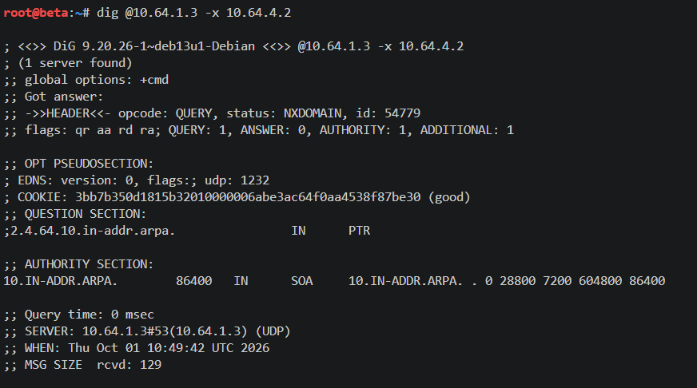

Query PTR mengembalikan hostname yang sesuai dengan alamat IP gerbang dan
backend. Pengujian melalui master maupun slave memastikan reverse DNS tersedia
di kedua nameserver.

### 9. Web statis area vault

`obladi` dan `desmond` dikonfigurasi manual sebagai web server Apache. Directory `/var/www/html/arsip` digunakan untuk menyimpan dokumen dan fitur autoindex diaktifkan.

```apache
<VirtualHost *:80>
    ServerName obladi.k01.com
    DocumentRoot /var/www/html

    <Directory /var/www/html/arsip>
        Options +Indexes
        AllowOverride All
        Require all granted
    </Directory>
</VirtualHost>
```

Pada `desmond`, `ServerName` diganti menjadi `desmond.k01.com`. File uji dibuat dengan:

```bash
mkdir -p /var/www/html/arsip
echo "Ini dokumen rahasia arsip 1" > /var/www/html/arsip/dokumen1.txt
echo "Ini dokumen rahasia arsip 2" > /var/www/html/arsip/dokumen2.txt
a2enmod autoindex
service apache2 restart
```

- client curl http://obladi.k01.com (obladi web server)
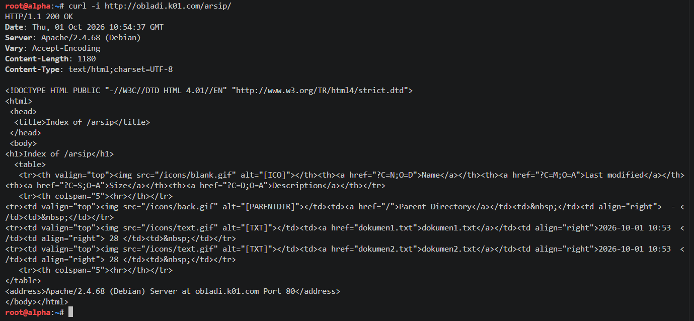

- client curl http://desmond.k01.com (desmond web server)
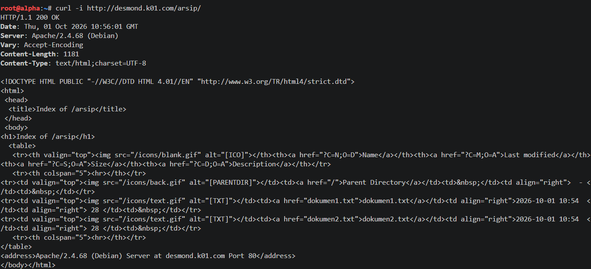

Response dari kedua hostname menampilkan directory listing `/arsip` beserta file
uji. Ini membuktikan Apache dan fitur autoindex berjalan pada area vault.

### 10. Web dinamis area core

`oblada` dan `molly` dikonfigurasi manual menggunakan Nginx dan PHP-FPM. Aplikasi memiliki `index.php` sebagai halaman beranda dan `profil.php` sebagai halaman profil.

```nginx
server {
    listen 80;
    server_name oblada.k01.com;
    root /var/www/html;
    index index.php index.html index.htm;

    location / {
        try_files $uri $uri/ =404;
    }

    location = /profil {
        rewrite ^ /profil.php last;
    }

    location ~ \.php$ {
        include snippets/fastcgi-php.conf;
        fastcgi_pass unix:/var/run/php/php8.4-fpm.sock;
        fastcgi_param SCRIPT_FILENAME $document_root$fastcgi_script_name;
        include fastcgi_params;
    }
}
```

- client curl http://oblada.k01.com (oblada web server)
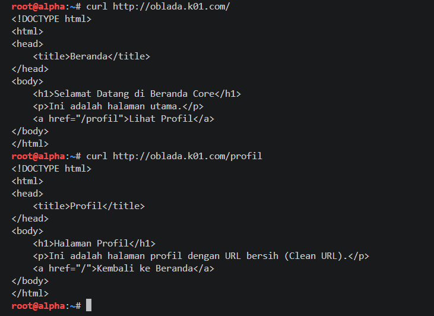

- client curl http://molly.k01.com (molly web server)
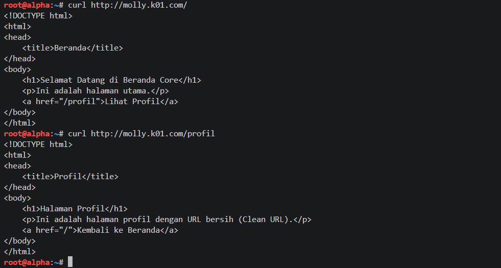

Halaman beranda dan `/profil` berhasil diproses oleh PHP-FPM. URL `/profil`
berfungsi tanpa akhiran `.php`, sehingga aturan rewrite Nginx berjalan sesuai
kebutuhan.

### 11. Reverse proxy dan load balancing

`penny` menjadi reverse proxy Apache untuk seluruh node area vault (`obladi` dan `desmond`), sedangkan `abbey` menjadi reverse proxy Nginx untuk seluruh node area core (`oblada` dan `molly`). Kedua gerbang meneruskan identitas request ke backend melalui header `Host` dan `X-Real-IP`.

Konfigurasi upstream dan reverse proxy pada `abbey`:

```nginx
upstream corecluster {
    server 10.64.1.6;
    server 10.64.1.7;
}

server {
    listen 80;
    server_name static.k01.com;

    location / {
        proxy_pass http://corecluster;
        proxy_set_header Host $host;
        proxy_set_header X-Real-IP $remote_addr;
        proxy_set_header X-Forwarded-For $proxy_add_x_forwarded_for;
    }
}
```

Konfigurasi load balancer pada `penny`:

```apache
<VirtualHost *:80>
    ServerName www.k01.com
    ProxyPreserveHost On

<Proxy balancer://vaultcluster>
    BalancerMember http://10.64.1.4
    BalancerMember http://10.64.1.5
    ProxySet lbmethod=byrequests
</Proxy>

    ProxyPass / balancer://vaultcluster/
    ProxyPassReverse / balancer://vaultcluster/
    RequestHeader set X-Real-IP "%{REMOTE_ADDR}s"
</VirtualHost>
```

Pengujian dilakukan dengan mengakses `www.k01.com` dan `static.k01.com` berulang kali untuk membuktikan bahwa request didistribusikan ke node-node backend yang sesuai.

- Client uji reverse proxy vault www
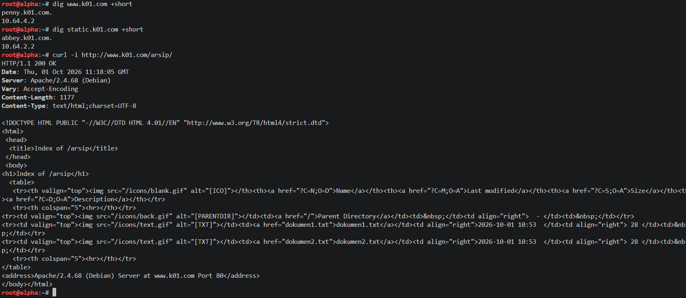

- Client uji reverse proxy core static
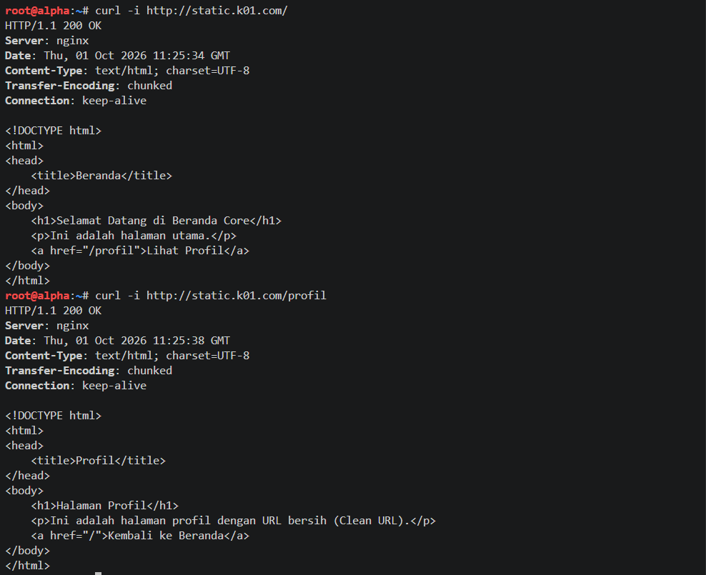

Response berasal dari layanan di belakang gerbang, bukan dari halaman lokal
`penny` atau `abbey`. Request ke `www.k01.com` diarahkan ke backend vault,
sedangkan request ke `static.k01.com` diarahkan ke backend core.


### 12. Basic authentication `/admin`

Path `/admin` pada `www.k01.com` diberi perlindungan Basic Authentication. Jalur ini dikecualikan dari `ProxyPass` agar autentikasi dilakukan oleh Apache pada `penny`. Request tanpa kredensial ditolak dengan status `401 Unauthorized`, sedangkan request dengan kredensial yang benar diteruskan ke halaman admin.

```apache
ProxyPass /admin !

<Location /admin>
    AuthType Basic
    AuthName "Area Rahasia Sindikat"
    AuthUserFile /etc/apache2/.htpasswd
    Require valid-user
</Location>
```

Kredensial dibuat pada node `penny`:

```bash
htpasswd -bc /etc/apache2/.htpasswd prabs "pakar_pinter_jadi_goblok"
a2enmod auth_basic authn_core authz_user
service apache2 restart
```

Pengujian:

```bash
curl -i http://www.k01.com/admin
curl -i -u prabs:'pakar_pinter_jadi_goblok' http://www.k01.com/admin
```

- Client curl http://www.k01.com/admin tanpa kredensial
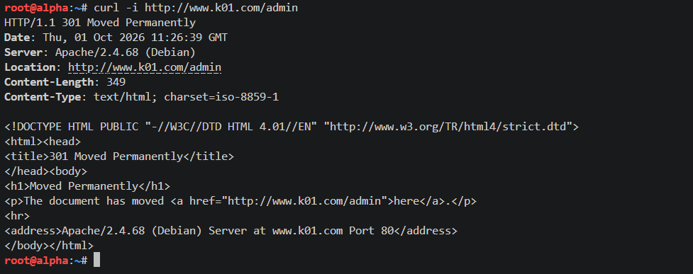

- Client curl http://www.k01.com/admin dengan kredensial
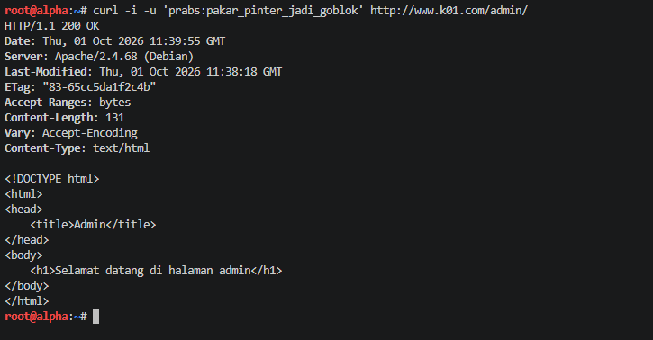

Request tanpa kredensial menghasilkan `401 Unauthorized`, sedangkan request
dengan username `prabs` dan password yang ditentukan berhasil melewati
autentikasi. Pengecualian `ProxyPass /admin !` memastikan autentikasi dilakukan
oleh Apache pada `penny`.

### 13. Redirect hostname kanonik

Akses ke `penny.k01.com` atau IP `10.64.4.2` diarahkan permanen dengan status `301` menuju `www.k01.com`. Akses ke `abbey.k01.com` atau IP `10.64.2.2` diarahkan sementara dengan status `302` menuju `static.k01.com`.

Konfigurasi redirect pada `penny`:

```apache
<VirtualHost *:80>
    ServerName penny.k01.com
    ServerAlias 10.64.4.2
    Redirect 301 / http://www.k01.com/
</VirtualHost>
```

Konfigurasi redirect pada `abbey`:

```nginx
server {
    listen 80;
    server_name abbey.k01.com 10.64.2.2;
    return 302 http://static.k01.com$request_uri;
}
```

Pengujian dilakukan dengan:

```bash
curl -I http://penny.k01.com/
curl -I http://abbey.k01.com/
```

- Client curl http://penny.k01.com/ (redirect 301) & http://abbey.k01.com/ (redirect 302)
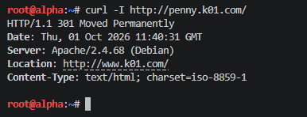

Header `Location` menunjukkan tujuan redirect yang benar: akses ke `penny`
menggunakan status permanen `301` menuju `www.k01.com`, sedangkan akses ke
`abbey` menggunakan status sementara `302` menuju `static.k01.com`.

### 14. Pencatatan IP Asli Client (Real IP Logging)
Setiap server web di area vault maupun core dikonfigurasi untuk mencatat alamat IP asli client yang diteruskan oleh gerbang melalui header `X-Forwarded-For`, bukan alamat IP milik `penny` maupun `abbey`.

Konfigurasi real IP pada server Nginx (`molly` dan `oblada`):

```nginx
set_real_ip_from 10.64.2.2;
real_ip_header X-Forwarded-For;
real_ip_recursive on;
```

Konfigurasi remote IP pada server Apache (`desmond` dan `obladi`):

```apache
RemoteIPHeader X-Forwarded-For
RemoteIPInternalProxy 10.64.4.2
```

Penyesuaian format log pada `/etc/apache2/apache2.conf`:

```bash
sed -i 's/%h %l %u %t \"%r\" %>s %b \"%{Referer}i\" \"%{User-Agent}i\"/%a %l %u %t \"%r\" %>s %b \"%{Referer}i\" \"%{User-Agent}i\"/' /etc/apache2/apache2.conf
```

Pengujian dilakukan dengan mengakses layanan melalui gerbang, kemudian memeriksa
access log pada backend. IP yang tercatat harus merupakan IP client, bukan IP
`penny` atau `abbey`.

```bash
curl -H "Host: www.k01.com" http://10.64.4.2/
curl -H "Host: static.k01.com" http://10.64.2.2/

# Periksa log pada backend vault dan core
tail -n 5 /var/log/apache2/access.log
tail -n 5 /var/log/nginx/access.log
```

- Client curl ke www.k01.com melalui penny dan static.k01.com melalui abbey
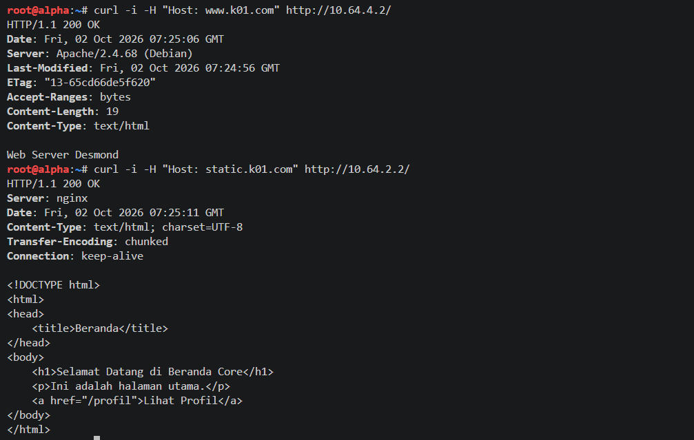

- Log access pada backend vault dan core menunjukkan alamat IP asli client (`10.64.3.2 alpha`)
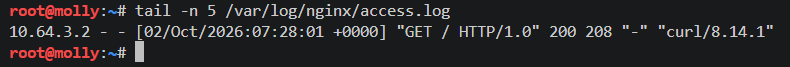
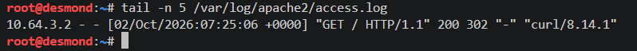

### 15. Jalur proxy khusus /eternal dan /orion
Pada `penny` dibuat jalur khusus `/eternal` yang menyajikan direktori
`/var/www/eternal` dan memproses file PHP melalui PHP-FPM. Jalur ini dikecualikan
dari balancer agar diproses langsung oleh `penny`.

```apache
# /etc/apache2/eternal.inc
ProxyPass /eternal !

Alias /eternal /var/www/eternal
<Directory /var/www/eternal>
    Require all granted
    DirectoryIndex index.php index.html
    <FilesMatch "\.php$">
        SetHandler "proxy:unix:/run/php/php8.4-fpm.sock|fcgi://localhost"
    </FilesMatch>
</Directory>
```

Pada `abbey`, jalur `/orion` menyajikan direktori `/var/www/orion` secara murni
statis tanpa rendering PHP:

```nginx
# /etc/nginx/abbey-locations/orion.conf
location /orion {
    root /var/www;
    index index.html;
    try_files $uri $uri/ =404;
}
```

File layanan pada backend dibuat dengan perintah berikut:

```bash
mkdir -p /var/www/eternal
echo "<?php phpinfo();" > /var/www/eternal/index.php

mkdir -p /var/www/orion
echo "Orion statis" > /var/www/orion/index.html
```

Dengan konfigurasi tersebut, `/eternal` menampilkan hasil eksekusi PHP,
sedangkan `/orion` hanya menyajikan berkas statis.

Virtual host utama pada `penny`:

```apache
<VirtualHost *:80>
    ServerName www.k01.com
    IncludeOptional /etc/apache2/eternal.inc
    ProxyPass / balancer://vaultcluster/
</VirtualHost>
```

Hasil pengujian `/eternal` menampilkan hasil eksekusi PHP, sedangkan `/orion`
menampilkan halaman HTML statis. Source PHP tidak tampil sebagai teks pada
response `/eternal`.

```bash
curl -i -H "Host: penny.k01.com" http://10.64.4.2/eternal/
curl -i -H "Host: abbey.k01.com" http://10.64.2.2/orion/
```
- Client curl ke /eternal dan /orion
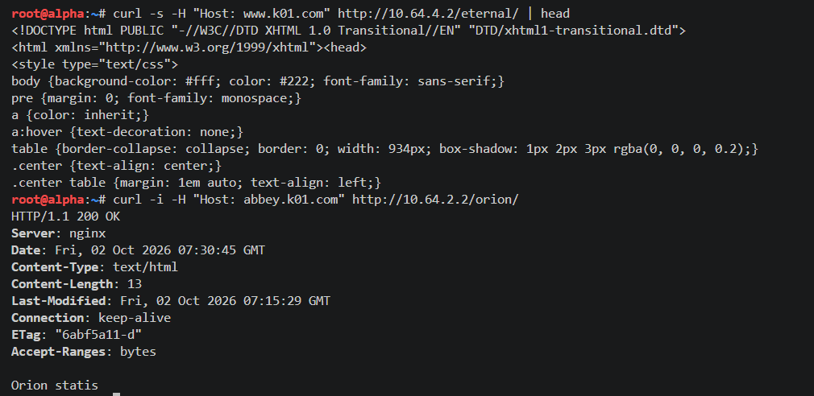

### 16. Benchmark dan stress test menggunakan ApacheBench
Pengujian ketahanan gerbang dilakukan dari klien `alpha` menggunakan ApacheBench dengan
mengirimkan 250 requests dan tingkat konkurensi 10 untuk masing-masing titik akhir `www.k01.com`
dan `static.k01.com`.
Perintah instalasi dan stress test pada `alpha`:

```bash
# Instalasi ApacheBench
apt-get update && apt-get install apache2-utils -y

# Stress test ke www.k01.com
ab -n 250 -c 10 http://www.k01.com/

# Stress test ke static.k01.com
ab -n 250 -c 10 http://static.k01.com/
```
Rangkuman Hasil Stress Test `www.k01.com`
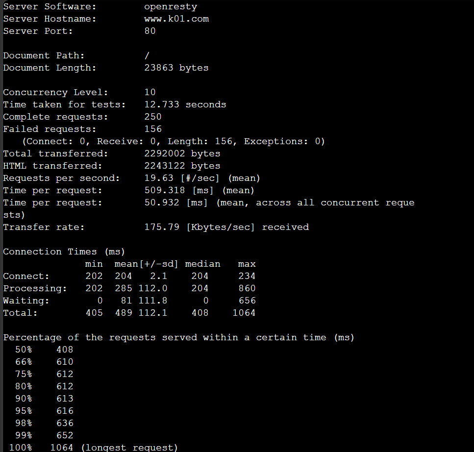

Rangkuman Hasil Stress Test `static.k01.com`
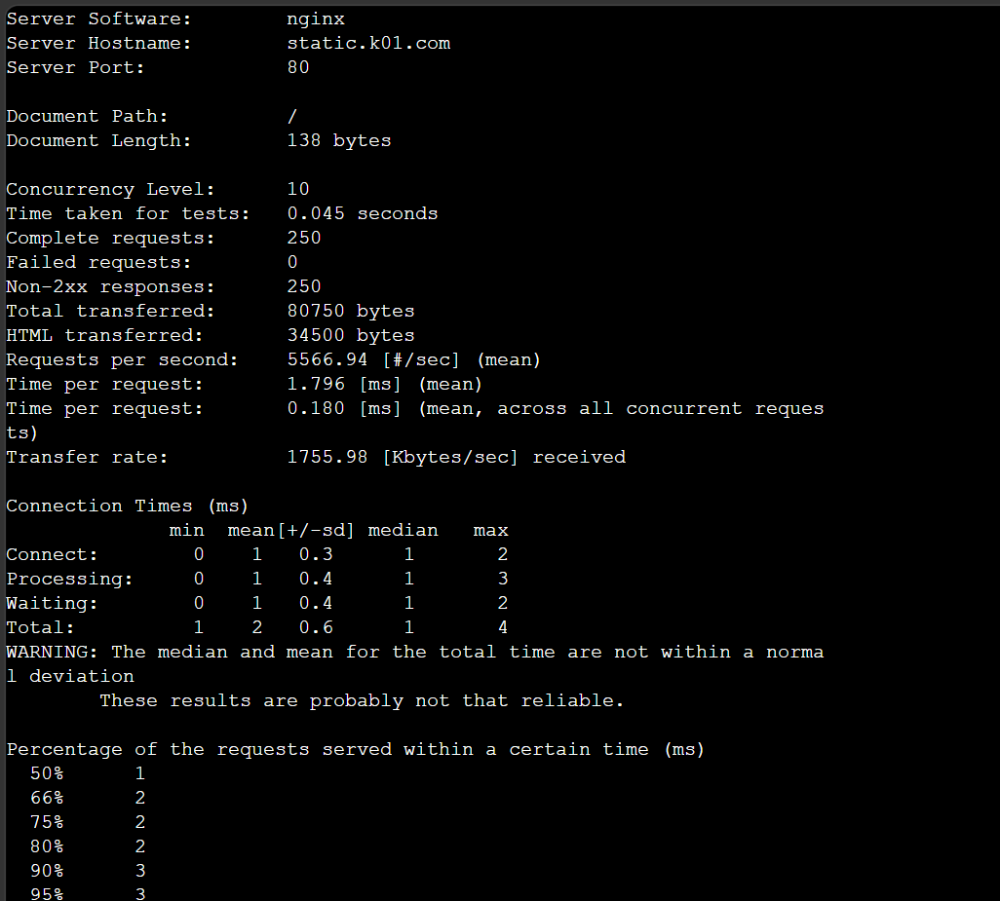

### 17. Penambahan TXT record DNS klien
Penambahan TXT record pada DNS server untuk seluruh klien sayap kiri dan kanan (`alpha`, `beta`,
`gamma`, `delta`, `epilson`). Query TXT terhadap nama domain klien mengembalikan teks berupa nama
hostname masing-masing.
Konfigurasi TXT record pada forward zone `prab` (`/etc/bind/k01/k01.com`):

```DNS zone file
alpha   IN  TXT "alpha"
beta    IN  TXT "beta"
gamma   IN  TXT "gamma"
delta   IN  TXT "delta"
eplison IN  TXT "eplison"
```

Perintah verifikasi kueri DNS dari setiap klien:

```bash
nslookup -type=txt alpha.k01.com
nslookup -type=txt beta.k01.com
nslookup -type=txt gamma.k01.com
nslookup -type=txt delta.k01.com
nslookup -type=txt eplison.k01.com
```

Jalankan DNS dari masing-masing node klien:

Alpha
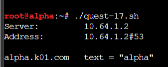

Beta
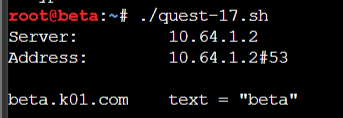

Gamma
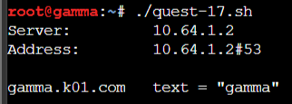

Delta
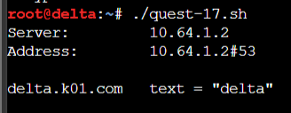

Epilson
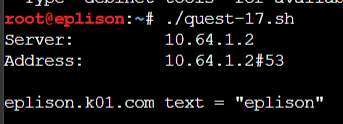

### 18. Modifikasi A record, kenaikan SOA serial, dan pengujian TTL cache

Pada zona DNS `prab`, record A `abbey.k01.com` diubah dari `10.64.2.2`
menjadi `10.200.200.1` dengan TTL 15 detik. Perubahan dilakukan menggunakan
`nodes/prab/quest-18.sh`. Script ini juga menaikkan serial SOA dan memuat ulang
zona dengan `rndc reload`.

Cuplikan script perubahan pada `prab`:

```bash
ZONE_FILE="/etc/bind/k01/k01.com"

sed -i 's/^abbey.*/abbey   15   IN   A   10.200.200.1/' $ZONE_FILE

SERIAL=$(grep -m1 'Serial' $ZONE_FILE | grep -oE '[0-9]{10}')
NEW=$((SERIAL + 1))
sed -i "/Serial/s/$SERIAL/$NEW/" $ZONE_FILE

named-checkzone k01.com $ZONE_FILE && rndc reload
```

Baris `sed` mengganti record A sekaligus menetapkan TTL 15 detik. Serial SOA
kemudian dinaikkan satu angka. Sebelum zona dimuat ulang, `named-checkzone`
memeriksa format file zona.

Pengamatan cache dilakukan dari `alpha` menggunakan resolver lokal `dnsmasq`.
Resolver tersebut meneruskan query ke DNS master `10.64.1.2`:

```bash
cat <<'EOF'> /etc/resolv.conf
nameserver 127.0.0.1
EOF

service dnsmasq stop 2>/dev/null
pkill dnsmasq 2>/dev/null
dnsmasq --no-poll --no-resolv -h \
  --listen-address=127.0.0.1 --server=10.64.1.2
```

Hasil pengujian terdiri atas tiga fase:

1. **Sebelum perubahan:** query mengembalikan IP lama `10.64.2.2`.
2. **Dalam 15 detik pertama:** meskipun record di `prab` sudah berubah, query
   masih mengembalikan `10.64.2.2` karena jawaban lama masih tersimpan di cache.
3. **Setelah TTL habis:** query berikutnya mengembalikan IP baru
   `10.200.200.1`.

Pemantauan perubahan TTL dilakukan dengan perulangan berikut:

```bash
for i in $(seq 1 35); do
  echo "$(date +%T) -> $(dig abbey.k01.com +noall +answer \
    | awk '{print "TTL="$2, $5}')"
  sleep 1
done
```

Perulangan tersebut menampilkan waktu, sisa TTL, dan IP hasil query setiap satu
detik. Perubahan IP terlihat setelah TTL habis.

Dokumentasi pengujian:

- 3 Fase
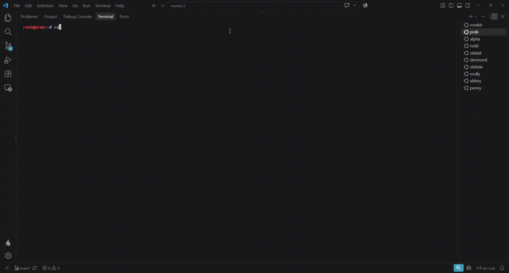

Setelah pengujian selesai, record dikembalikan ke alamat awal menggunakan
`nodes/prab/reset-18.sh`. Serial SOA kembali dinaikkan dan zona dimuat ulang.

Cuplikan pemulihan record:

```bash
sed -i 's/^abbey.*/abbey   15   IN   A   10.64.2.2/' $ZONE_FILE
named-checkzone k01.com $ZONE_FILE && rndc reload
```

### 19. CNAME outbound menuju domain eksternal

Record CNAME `outbound.k01.com` ditambahkan pada zona `k01.com` di `prab`.
Record tersebut mengarahkan domain internal ke `http.badssl.com`:

```dns
outbound IN CNAME http.badssl.com.
```

Konfigurasi ini diterapkan oleh `nodes/prab/quest-19.sh`. Setelah zona DNS
dimuat ulang, pengujian dilakukan dari client menggunakan:

```bash
dig outbound.k01.com CNAME
curl -H "Host: http.badssl.com" http://outbound.k01.com
```

Query DNS menunjukkan `outbound.k01.com` sebagai alias
`http.badssl.com`. Request HTTP menampilkan konten dari halaman tujuan.

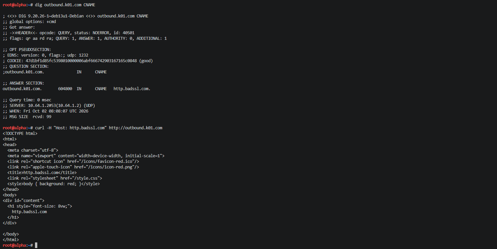

### 20. Pemeriksaan service dan autostart

Pemeriksaan akhir dilakukan pada setiap node sesuai service yang digunakan.
`bind9` diperiksa pada `prab`, `nginx` dan `php8.4-fpm` pada `oblada` serta
`molly`, sedangkan `apache2` diperiksa pada `obladi`, `desmond`, dan `penny`.
Status `running` menunjukkan service sedang berjalan.

Pada `prab`:
```bash
service bind9 status
```

Pada `oblada` dan `molly`:
```bash
service nginx status
service php8.4-fpm status
```

Pada `obladi`, `desmond`, dan `penny`:
```bash
service apache2 status
```